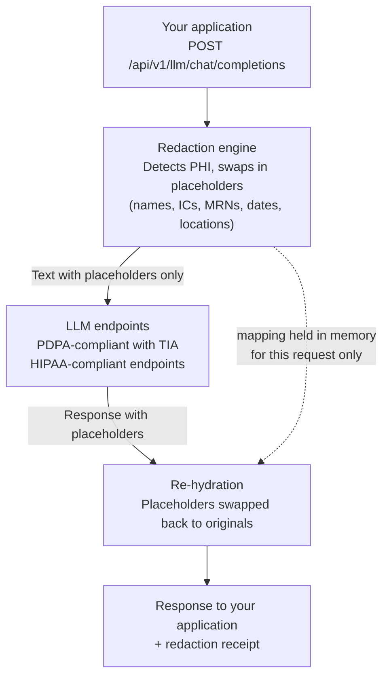

Every LLM-bound request passes through the PHI-safe gateway. The gateway removes patient identifiers **server-side, before** the text reaches any model, and restores them **after** the response returns. Your application sends and receives normal text; the model only ever sees placeholders.

## Why this exists

Clinical text is regulated personal data. A direct call to a general LLM API discloses that data to servers you cannot name — and most healthcare data-protection duties do not allow that.

- **PDPA (Malaysia).** The Personal Data Protection Act 2010 restricts cross-border transfer of personal data: disclosures must go to destinations you can name and justify, and processors carry binding security duties. Our completed Transfer Impact Assessment (TIA) — the formal record of where the data goes, what protection applies there, and why the transfer is justified — is available to customers on request. A generic LLM endpoint satisfies none of this.
- **HIPAA (US).** Protected Health Information may only reach vendors under a Business Associate Agreement (BAA). A BAA is a contract that makes the vendor legally responsible for safeguarding PHI: required security controls, breach notification duties, limits on use and further disclosure, and return-or-destroy obligations at contract end. Without a signed BAA, sending PHI to a vendor is itself a HIPAA violation — no matter how secure the vendor is. We hold BAAs with our infrastructure providers, including AWS and Microsoft Azure; the gateway's model endpoints run only on HIPAA-eligible infrastructure under those agreements, and de-identified data falls outside the restriction entirely.
- **GDPR and similar regimes.** The same pattern: special-category health data, transfer restrictions, processor obligations.

The gateway resolves this by changing **what leaves**, not by asking you to trust where it goes:

1. Identifiers are stripped server-side before any model call — the model receives de-identified text.
2. Traffic that could carry PHI runs only on **named, APAC-bounded infrastructure**, so the destination is specific and auditable.
3. The [redaction receipt](/api/redaction-receipts) on every response is your audit evidence of both.

<Note>
The gateway supports your compliance program; it does not replace it. Your organization remains responsible for its own regulatory assessment.
</Note>

## How a request flows



## What the gateway guarantees

<CardGroup cols={2}>
  <Card title="Fail-closed" icon="shield">
    If the redaction engine is unavailable, the request fails with a `503`. Un-redacted text is never forwarded.
  </Card>
  <Card title="Redaction receipts" icon="receipt">
    Every response carries a receipt: what was detected, what was replaced, and which model served the request. See [Redaction receipts](/api/redaction-receipts).
  </Card>
  <Card title="No retention" icon="database">
    With `persist_bodies=false`, request and response bodies are not stored. The placeholder mapping lives in memory for the single request only.
  </Card>
  <Card title="Bounded residency" icon="globe">
    PHI-bearing traffic is served only by models on approved, APAC-bounded infrastructure. Models without that approval refuse PHI traffic.
  </Card>
</CardGroup>

## Quickstart

The gateway is OpenAI-compatible. Point any OpenAI SDK at `.../api/v1/llm` and it works unmodified:

<CodeGroup>

```python Python
from openai import OpenAI

client = OpenAI(
    base_url="https://api.v2.healthproximate.com/api/v1/llm",
    api_key="hpx_...",  # your Healthproximate API key
)

response = client.chat.completions.create(
    model="apac.amazon.nova-pro-v1:0",
    messages=[{"role": "user", "content": "Summarize: Patient Ahmad bin Ali, IC 800101-14-5555, admitted for pneumonia..."}],
)
print(response.choices[0].message.content)
```

```bash curl
curl https://api.v2.healthproximate.com/api/v1/llm/chat/completions \
  -H "Authorization: Bearer hpx_..." \
  -H "Content-Type: application/json" \
  -d '{
    "model": "apac.amazon.nova-pro-v1:0",
    "messages": [{"role": "user", "content": "Summarize: Patient Ahmad bin Ali, IC 800101-14-5555, admitted for pneumonia..."}]
  }'
```

</CodeGroup>

The name and IC number in that prompt never reach the model — the redaction engine replaces them before the model call and restores them in the response. The receipt on the response proves it. See [Models](/api/models) for the full model list.

## Standalone redaction

If you only need de-identification, call [`POST /api/v1/redact`](/api-reference). It returns the redacted text **and the mapping** to you, and stores neither.

## Where to go next

1. Get a key and pick a header style: [Authentication](/api/authentication).
2. Read the error and rate-limit contract: [Errors & limits](/api/errors-and-limits).
3. Call the gateway with any OpenAI-compatible SDK pointed at `.../api/v1/llm`.
