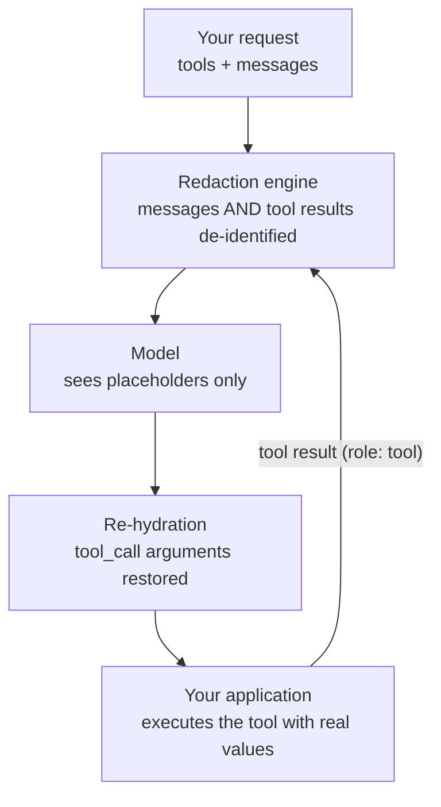

The gateway supports OpenAI-style tool calling. Define tools in the request, receive `tool_calls` in the response, send tool results back with the `tool` role. Any OpenAI SDK works unmodified.

Every model in the [catalog](/api/models) supports tool calling — models without tool support are not listed.

## How PHI protection applies

Tool calling adds two hops where identifiers could leak. The gateway covers both:



1. **Outbound:** message content and your `tool` role results are redacted before the model sees them.
2. **Inbound:** `tool_calls` arguments come back re-hydrated, so your function receives real values, not placeholders.

## Define and call a tool

<CodeGroup>

```python Python
from openai import OpenAI

client = OpenAI(
    base_url="https://api.v2.healthproximate.com/api/v1/llm",
    api_key="hpx_...",
)

tools = [{
    "type": "function",
    "function": {
        "name": "lookup_bed_availability",
        "description": "Check available beds for a ward",
        "parameters": {
            "type": "object",
            "properties": {
                "ward": {"type": "string", "description": "Ward name"}
            },
            "required": ["ward"],
        },
    },
}]

messages = [{"role": "user", "content": "Does the medical ward have a bed for Ahmad bin Ali?"}]

response = client.chat.completions.create(
    model="apac.amazon.nova-pro-v1:0",
    messages=messages,
    tools=tools,
)

tool_call = response.choices[0].message.tool_calls[0]
print(tool_call.function.name)       # lookup_bed_availability
print(tool_call.function.arguments)  # {"ward": "medical"}
```

```bash curl
curl https://api.v2.healthproximate.com/api/v1/llm/chat/completions \
  -H "Authorization: Bearer hpx_..." \
  -H "Content-Type: application/json" \
  -d '{
    "model": "apac.amazon.nova-pro-v1:0",
    "messages": [{"role": "user", "content": "Does the medical ward have a bed for Ahmad bin Ali?"}],
    "tools": [{
      "type": "function",
      "function": {
        "name": "lookup_bed_availability",
        "description": "Check available beds for a ward",
        "parameters": {
          "type": "object",
          "properties": {"ward": {"type": "string"}},
          "required": ["ward"]
        }
      }
    }]
  }'
```

</CodeGroup>

## Return the tool result

Append the assistant turn and your result, then call again:

```python
messages.append(response.choices[0].message)
messages.append({
    "role": "tool",
    "tool_call_id": tool_call.id,
    "content": '{"ward": "medical", "available_beds": 3}',
})

final = client.chat.completions.create(
    model="apac.amazon.nova-pro-v1:0",
    messages=messages,
    tools=tools,
)
print(final.choices[0].message.content)
```

Your tool result passes through the same redaction as user messages. If the result contains patient identifiers, the model still sees placeholders.

<Note>
  **Streamed tool calls:** streamed responses (`stream: true`) do not support tools; run tool calls unstreamed. Placeholder re-hydration needs the complete arguments before it can restore values safely.
</Note>

## Errors

| Status | Code | Meaning |
| --- | --- | --- |
| `400` | `unsupported_parameter` | The request used a tool feature the gateway does not forward (for example, tools combined with `stream: true`). The gateway refuses loudly rather than silently drop your tools. |

See [Errors & limits](/api/errors-and-limits) for the full contract.
